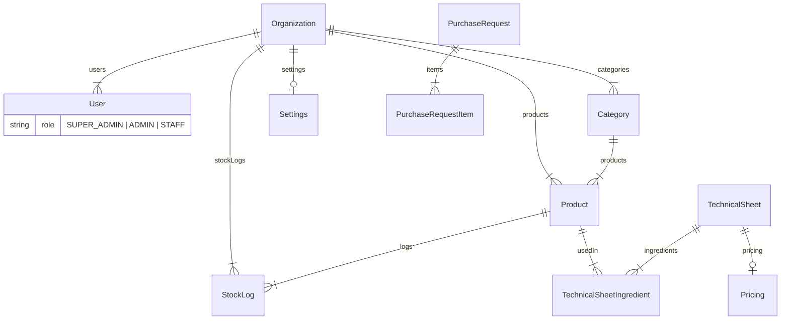

# Referência de Banco de Dados e API

Este documento detalha o schema do banco de dados (Prisma) e os endpoints da API do sistema "Estoque Restaurante". É um guia técnico para manutenção, integração e consultas diretas ao banco.

---

## 1. Diagrama de Entidade-Relacionamento (ERD)

A estrutura central gira em torno da **Organization** (Tenant). Todos os recursos principais (Produtos, Categorias, Usuários) pertencem a uma organização.

---

## 2. Descrição dos Modelos

### `Organization` (Tenant)
A entidade raiz que isola os dados de cada cliente.
| Campo | Tipo | Descrição |
| :--- | :--- | :--- |
| `id` | String (CUID) | PK única. |
| `slug` | String | Identificador único na URL (ex: `/org/restaurante-x`). |
| `plan` | Enum | `FREE`, `PRO`, `ENTERPRISE`. Define funcionalidades. |
| `maxUsers` | Int | Limite de usuários permitidos. |
| `isActive` | Boolean | Se `false`, bloqueia o acesso de todos os usuários. |

### `User` (Usuário)
Usuários do sistema. Se `role` for SUPER_ADMIN, `organizationId` pode ser nulo.
| Campo | Tipo | Descrição |
| :--- | :--- | :--- |
| `privyId` | String | ID externo do provedor de auth (Stack Auth/Privy). |
| `role` | Enum | `SUPER_ADMIN`, `ADMIN`, `STAFF`. |
| `organizationId` | FK | Vincula o usuário a uma empresa específica. |

### `Product` (Produto)
Item de estoque.
| Campo | Tipo | Descrição |
| :--- | :--- | :--- |
| `minStock` | Float | Ponto de reabastecimento. |
| `currentStock` | Float | Quantidade atual (atualizado via StockLog). |
| `unitPrice` | Float | Custo unitário para cálculos de ficha técnica. |

### `StockLog` (Histórico)
Registro imutável de movimentação.
| Campo | Tipo | Descrição |
| :--- | :--- | :--- |
| `action` | String | `CREATE`, `UPDATE`, `DELETE`, `LOSS` (Perda). |
| `previousStock` | Float | Snapshot anterior. |
| `newStock` | Float | Snapshot pós-operação. |
| `responsible` | String | Nome do usuário que realizou a ação. |

### `TechnicalSheet` (Ficha Técnica)
Receita ou prato composto.
| Campo | Tipo | Descrição |
| :--- | :--- | :--- |
| `yield` | Int | Rendimento (quantas porções rende). |
| `prepTime` | Int | Tempo de preparo em minutos. |

---

## 3. Catálogo de API

### Autenticação & Contexto
*   **GET** `/api/user-context`: Retorna dados da sessão atual, role e organização. Fundamental para o frontend determinar permissões.

### Endpoints de Super Admin
*Requer role `SUPER_ADMIN`*
*   **GET** `/api/admin/organizations`: Lista todas as empresas e métricas.
*   **PUT** `/api/admin/organizations`: Edita dados da empresa (Plano, Status).
*   **GET** `/api/admin/organizations/[id]/staff`: Lista membros de uma empresa específica.
*   **POST** `/api/admin/organizations/[id]/staff`: Adiciona usuário a uma empresa.
*   **GET** `/api/admin/users`: Busca global de usuários.
*   **PUT** `/api/admin/users`: Edita role ou organização de qualquer usuário.
*   **DELETE** `/api/admin/users`: Desativa/Remove usuário do sistema.

### Endpoints de Tenant (Dashboard)
*Requer `organizationId` no contexto*

#### Produtos (`/api/products`)
*   **GET**: Lista produtos da empresa (suporta `?search=` e `?categoryId=`).
*   **POST**: Cria novo produto.
*   **PUT**: Atualiza produto existente.
*   **DELETE**: Remove produto.

#### Categorias (`/api/categories`)
*   **GET**: Lista categorias.
*   **POST**: Cria nova categoria.

#### Estoque (`/api/stock`)
*   **POST**: Registra movimentação (entrada/saída). Gera `StockLog` automaticamente.

#### Fichas Técnicas (`/api/technical-sheets`)
*   **GET**: Lista receitas.
*   **POST**: Cria receita com ingredientes e precificação.

#### Configurações (`/api/settings`)
*   **GET**: Retorna configurações da empresa (Alertas de estoque, nome).
*   **PUT**: Atualiza configurações.

---

> Referência gerada em 04/01/2026.
